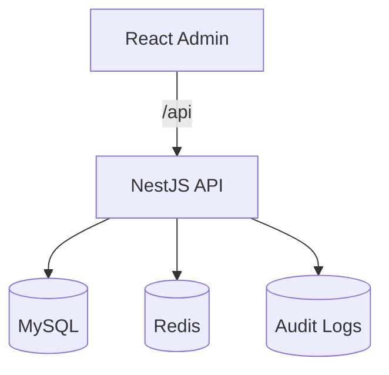

# 技术设计: 企业级 RBAC 权限管理系统

## 技术方案
### 核心技术
- NestJS 10 / TypeScript / TypeORM / MySQL / Redis
- React 18 / Vite / Ant Design / React Router / Redux Toolkit
- JWT accessToken + refreshToken（tokenVersion 策略）
- Swagger / Docker Compose / Nginx

### 实现关键点
- 后端统一响应格式与异常过滤器
- Auth 模块支持登录/刷新/退出与 Guard 权限控制
- RBAC 实体与多对多关系建模
- 资源树与权限码用于菜单与按钮级控制
- 审计日志记录登录与增删改动作

## 架构设计


## 架构决策 ADR
### ADR-001: 使用 tokenVersion 策略管理 refreshToken
**Context:** 需要支持 refreshToken 失效与退出登录机制
**Decision:** 在用户表中维护 tokenVersion，每次退出或重置时递增
**Rationale:** 简单可控，避免维护黑名单表
**Alternatives:** 黑名单列表 → 需要额外存储与清理策略
**Impact:** refreshToken 必须包含 tokenVersion 校验

## API 设计
### POST /api/auth/login
- **Request:** { username, password }
- **Response:** { accessToken, refreshToken, profile }

### POST /api/auth/refresh
- **Request:** { refreshToken }
- **Response:** { accessToken, refreshToken }

### GET /api/resources/tree
- **Request:** {}
- **Response:** 菜单树 + 权限码

## 数据模型
```sql
-- users
id BIGINT PK
username VARCHAR UNIQUE
password_hash VARCHAR
status TINYINT
token_version INT
created_at DATETIME
updated_at DATETIME

-- roles, permissions, resources, user_roles, role_permissions, audit_logs
```

## 安全与性能
- **安全:** bcrypt 加密密码、refreshToken 校验 tokenVersion、CORS 白名单、限流
- **性能:** 权限码与菜单树缓存（可选 Redis），分页接口索引优化

## 测试与部署
- **测试:** Jest 单元测试覆盖登录/刷新/Guard
- **部署:** Docker Compose + Nginx，Node 20 生产镜像
