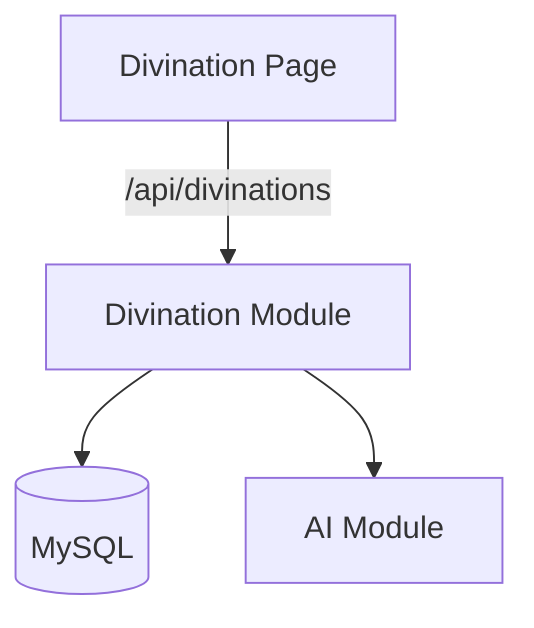

# 技术设计: 六爻占卜与 AI 解卦模块

## 技术方案
### 核心技术
- NestJS 10 / TypeORM
- React 18 / Ant Design
- AI: DeepSeek + OpenAI（后端统一封装）

### 实现关键点
- 后端生成六爻结果并写入数据库
- AI 模块统一封装供应商调用与兜底策略
- 前端动画与结果展示分离，动画结束后展示解读

## 架构设计


## 架构决策 ADR
### ADR-002: 后端统一生成六爻并调用 AI
**Context:** 需要结果可追溯且一致
**Decision:** 六爻计算与 AI 解卦放在后端执行并落库
**Rationale:** 便于审计、避免前端篡改与重复逻辑
**Alternatives:** 前端生成 + 后端保存 → 一致性差
**Impact:** 后端需要 AI 配置与容错

## API 设计
### POST /api/divinations
- **Request:** { topic: string }
- **Response:** { id, topic, lines, interpretation }

### GET /api/divinations/:id
- **Request:** {}
- **Response:** { id, topic, lines, interpretation, createdAt }

### POST /api/ai/interpret
- **Request:** { lines, topic }
- **Response:** { interpretation }

## 数据模型
```sql
-- divinations
id BIGINT PK
topic VARCHAR
interpretation TEXT
created_at DATETIME
updated_at DATETIME

-- divination_lines
id BIGINT PK
divination_id BIGINT
line_index INT
sign_str VARCHAR
sum INT
symbol VARCHAR
name VARCHAR
created_at DATETIME
```

## 安全与性能
- **安全:** AI 调用限流、输入校验、敏感信息脱敏
- **性能:** 结果缓存（可选），日志不记录主题内容

## 测试与部署
- **测试:** 新增 divination 模块 service 单元测试
- **部署:** 现有 Docker Compose 保持不变
