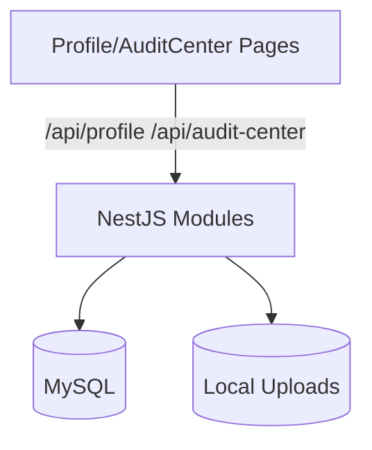

# 技术设计: 个人中心与日志中心模块

## 技术方案
### 核心技术
- NestJS 10 / TypeORM
- React 18 / Ant Design

### 实现关键点
- 新增 audit-center 模块统一日志查询接口
- 新增 profile 模块处理资料更新、密码修改、头像上传
- 头像上传使用本地存储（public/uploads），返回访问 URL

## 架构设计


## 架构决策 ADR
### ADR-003: 日志中心独立模块
**Context:** 需要独立的日志查询与权限控制
**Decision:** 新增 audit-center 模块与独立接口
**Rationale:** 清晰职责边界，后续可扩展
**Alternatives:** 复用 Audit 模块 → 维护与权限耦合
**Impact:** 新增模块与权限码

## API 设计
### GET /api/audit-center
- **Request:** page, pageSize, userId, module, start, end
- **Response:** 日志分页数据

### GET /api/audit-center/:id
- **Request:** {}
- **Response:** 日志详情

### GET /api/profile
- **Request:** {}
- **Response:** 用户资料

### PATCH /api/profile
- **Request:** nickname, email, avatarUrl
- **Response:** 更新后的资料

### POST /api/profile/password
- **Request:** oldPassword, newPassword
- **Response:** success

### POST /api/profile/avatar
- **Request:** multipart/form-data
- **Response:** avatarUrl

## 数据模型
```sql
-- users
avatar_url VARCHAR

-- audit_logs
id BIGINT PK
user_id BIGINT
module VARCHAR
action VARCHAR
detail TEXT
created_at DATETIME
```

## 安全与性能
- **安全:** 上传类型/大小校验、权限控制、敏感字段过滤
- **性能:** 日志分页索引、筛选条件使用索引

## 测试与部署
- **测试:** 新增 profile 与 audit-center 基础测试
- **部署:** 上传目录挂载为可写卷
