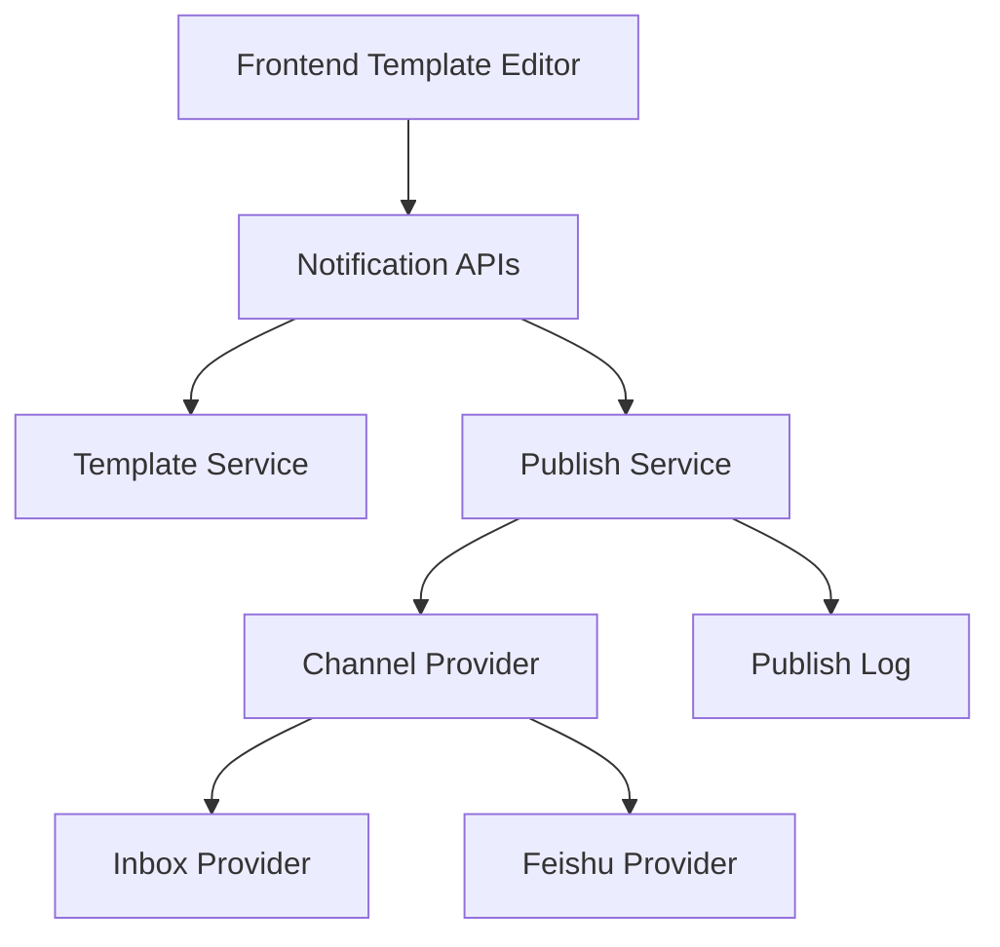

# Technical Design: 通知管理模块

## Technical Solution
### Core Technologies
- NestJS 10 / TypeScript / TypeORM / MySQL / Redis
- React 18 / Ant Design / Redux Toolkit

### Implementation Key Points
- 通道适配器抽象为 Provider（站内信、飞书）
- 变量占位符格式：`{{var.<key>}}`，模板渲染时进行安全替换
- 统一状态机：Draft/Published/Sending/Success/Failed/Retrying

## Architecture Design


## Architecture Decision ADR
### ADR-001: 通道适配器可插拔方案
**Context:** 通知通道后续需扩展，当前仅支持站内信与飞书。
**Decision:** 使用 Provider 抽象通道适配器，统一发送接口与回执解析。
**Rationale:** 解耦通道实现，便于后续接入短信/邮件/推送。
**Alternatives:** 直接在服务层硬编码通道逻辑 → Rejection reason: 扩展成本高。
**Impact:** 增加模块复杂度，需要维护适配器注册与配置。

## API Design
### [POST] /notification/templates
- **Request:** { name, channelTypes[], content, variables[] }
- **Response:** { id }

### [PUT] /notification/templates/:id
- **Request:** { name, channelTypes[], content, variables[], status }
- **Response:** { id }

### [GET] /notification/templates
- **Request:** { keyword?, status? }
- **Response:** { list[], total }

### [POST] /notification/publish
- **Request:** { templateId, channelType, payload, recipients[] }
- **Response:** { publishId }

### [GET] /notification/publish
- **Request:** { status?, channelType?, templateId? }
- **Response:** { list[], total }

### [POST] /notification/publish/:id/retry
- **Request:** { reason? }
- **Response:** { publishId, status }

## Data Model
```sql
-- notification_template
id BIGINT PK
name VARCHAR
channel_types JSON
content TEXT
variables JSON
status VARCHAR
created_at DATETIME
updated_at DATETIME

-- notification_publish
id BIGINT PK
template_id BIGINT
channel_type VARCHAR
payload JSON
status VARCHAR
fail_reason TEXT
retry_count INT
created_at DATETIME
updated_at DATETIME

-- notification_message (站内信)
id BIGINT PK
publish_id BIGINT
user_id BIGINT
title VARCHAR
content TEXT
status VARCHAR
created_at DATETIME
```

## Security and Performance
- **Security:** 模板变量严格白名单校验；日志脱敏；权限校验按模块权限控制。
- **Performance:** 发布记录分页查询；通道发送异步化（队列预留接口）。

## Testing and Deployment
- **Testing:** 模板渲染单测；发布流程集成测试；重试幂等测试。
- **Deployment:** 先灰度开启飞书通道，监控失败率与重试频次。
