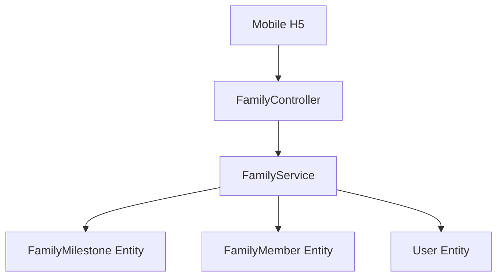

# Technical Design: 家庭大事纪服务端接口

## Technical Solution
### Core Technologies
- NestJS 10
- TypeORM 0.3
- class-validator / class-transformer

### Implementation Key Points
- 在 `FamilyModule` 内扩展接口，复用 JWT 鉴权、家庭成员表和房主角色。
- `family_milestones` 使用数值主键，响应层统一转为字符串，匹配现有家庭模块风格。
- `happenDate` 保存为 `YYYY-MM` 或 `YYYY-MM-DD` 字符串，支持模糊日期并保持可排序。
- `relatedMemberIds` 与 `imageList` 使用 JSON 字段保存数组。

## Architecture Design


## Architecture Decision ADR
### ADR-202608081814: 大事纪接口归属 FamilyModule
**Context:** 大事纪是家庭域内的业务能力，权限依赖家庭成员和房主角色。
**Decision:** 不新增独立 Nest 模块，直接扩展 `FamilyModule`。
**Rationale:** 减少重复权限服务，保持移动端 `/api/family/*` 接口聚合一致。
**Alternatives:** 新增 `MilestoneModule`，但需要导出更多家庭内部校验方法，当前收益不足。
**Impact:** `FamilyService` 继续变大，后续家庭域明显膨胀时可再拆分子服务。

## API Design
### GET /api/family/:familyId/milestones
- **Request:** `type`, `isCore?`, `page?`, `pageSize?`
- **Response:** `{ list, total, page, pageSize }`

### GET /api/family/:familyId/milestones/summary
- **Request:** `type`
- **Response:** `{ type, title, list }`

### GET /api/family/:familyId/milestones/:milestoneId
- **Request:** `familyId`, `milestoneId`
- **Response:** 完整大事纪对象

### POST /api/family/:familyId/milestones
- **Request:** `type`, `title`, `happenDate`, `desc?`, `isCore?`, `relatedMemberIds?`, `imageList?`
- **Response:** 完整大事纪对象

### PUT /api/family/:familyId/milestones/:milestoneId
- **Request:** 可更新字段，不允许变更 `type`
- **Response:** 完整大事纪对象

### PATCH /api/family/:familyId/milestones/:milestoneId/core
- **Request:** `{ isCore }`
- **Response:** `{ id, isCore, updatedAt }`

### DELETE /api/family/:familyId/milestones/:milestoneId
- **Request:** `familyId`, `milestoneId`
- **Response:** `{ success: true }`

## Data Model
```sql
CREATE TABLE family_milestones (
  id int NOT NULL AUTO_INCREMENT PRIMARY KEY,
  family_id int NOT NULL,
  type varchar(20) NOT NULL,
  title varchar(50) NOT NULL,
  happen_date varchar(10) NOT NULL,
  `desc` varchar(500) NOT NULL DEFAULT '',
  is_core tinyint NOT NULL DEFAULT 0,
  creator_id int NOT NULL,
  creator_name varchar(50) NOT NULL,
  related_member_ids json NOT NULL,
  image_list json NOT NULL,
  created_at datetime NOT NULL,
  updated_at datetime NOT NULL,
  INDEX idx_milestone_list (family_id, type, happen_date),
  INDEX idx_milestone_summary (family_id, type, is_core, happen_date),
  INDEX idx_milestone_creator (creator_id)
);
```

## Security and Performance
- **Security:** 所有接口先校验家庭成员身份；修改类接口按个人/家庭事件分别校验创建人和房主权限。
- **Performance:** 使用复合索引覆盖列表与碑文汇总查询；列表默认分页，最大 `pageSize=100`。

## Testing and Deployment
- **Testing:** 执行 TypeScript 构建，覆盖新增实体、DTO 和接口类型检查。
- **Deployment:** 非测试环境需确认 `DB_SYNC=true` 或提供等价数据库迁移后再发布。
