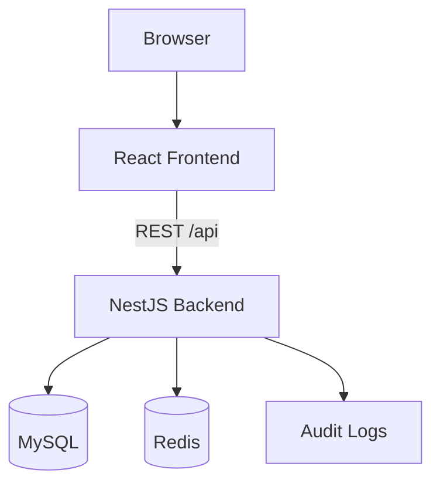
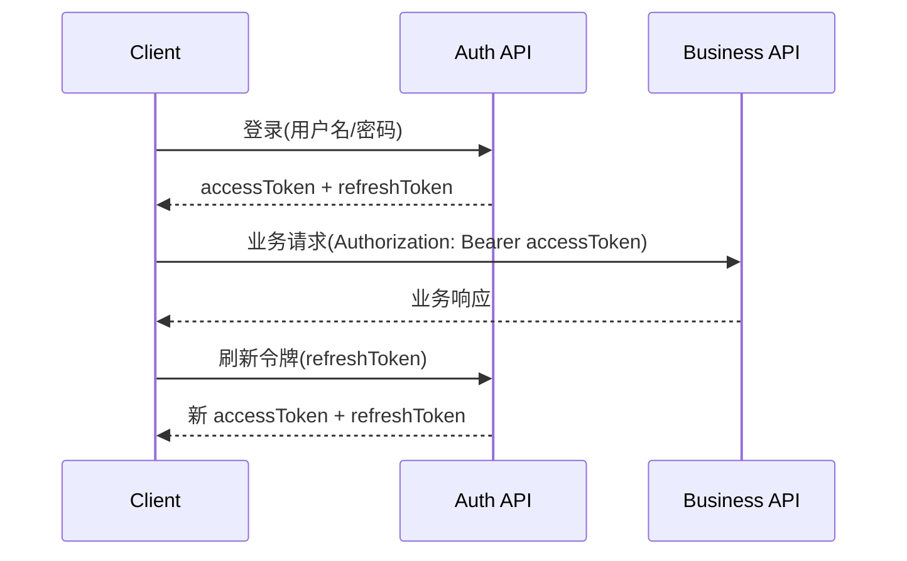

# 架构设计

## 总体架构

## 技术栈
- **Backend:** NestJS 10 / TypeScript / TypeORM
- **Frontend:** React 18 / Vite / Ant Design
- **Data:** MySQL / Redis

## 核心流程

## 主要架构决策
完整 ADR 存储在每次变更的 how.md 中，此处提供索引。

| adr_id | title | date | status | affected_modules | details |
|--------|-------|------|--------|------------------|---------|
| ADR-001 | TokenVersion 刷新令牌策略 | 2025-01-25 | ✅Adopted | auth | [详情](../history/2026-01/202601250851_rbac_system/how.md#adr-001-使用-tokenversion-策略管理-refreshtoken) |
| ADR-002 | 后端统一生成六爻与 AI 解卦 | 2026-01-25 | ✅Adopted | divination, ai | [详情](../history/2026-01/202601251127_divination_ai/how.md#adr-002-后端统一生成六爻与-ai-解卦) |
| ADR-003 | 日志中心独立模块 | 2026-01-25 | ✅Adopted | audit-center, profile | [详情](../history/2026-01/202601251353_profile_audit_center/how.md#adr-003-日志中心独立模块) |
| ADR-004 | 日志分表与批量上报 | 2026-01-25 | ✅Adopted | log-center, frontend | [详情](../history/2026-01/202601251534_log_center_enhance/how.md#adr-004-日志类型分表--统一查询层) |
| ADR-005 | 字典分表与缓存 | 2026-01-25 | ✅Adopted | dict | [详情](../history/2026-01/202601251700_dict_management/how.md#adr-005-字典分表--redis-缓存) |
